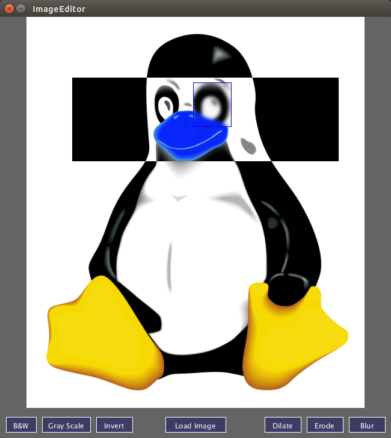

# ImageEditor

This project is coursework associated with Coursera's
[Creative Programming for Digital Media & Mobile Apps](https://www.coursera.org/course/digitalmedia).
It is a simple image manipulation application, allowing colors to be inverted,
images to be blurred, etc. Load an image then drag to make a selection. It
does not save images :)



## Running (Command Line)

You'll need to have a working copy of [Processing](https://processing.org/), a
programming language geared at visual arts. Download it and unzip; make note
of the `processing-java` command it contains.

Next, clone this repository into a folder named "ImageEditor". From one
directory above (i.e. the parent of the "ImageEditor" folder), execute:

```
/path/to/processing-java --sketch=ImageEditor --run
```

## Running (IDE)
You'll need to have a working copy of [Processing](https://processing.org/), a
programming language geared at visual arts. Download it and unzip; open the
`processing` program it contains. This is Processing's IDE.

Next, clone this repository into a folder named "ImageEditor". Then, through
Processing's UI, select "File > Open" and navigate to the "ImageEditor.pde"
file. Once this is loaded, click the "Play" button.

## Running (Docker)
If you have [docker](http://docker.io/) installed (and are running a Linux
host), you can use the pre-built image, so long as you also connect relevant
video:

```
docker run -it --rm \
-e DISPLAY=$DISPLAY \
-v /tmp/.X11-unix:/tmp/.X11-unix \
cmc333333/imageeditor
```

You'll probably want to mount a folder with images, too:
```
docker run -it --rm \
-e DISPLAY=$DISPLAY \
-v /tmp/.X11-unix:/tmp/.X11-unix \
-v "$HOME/Pictures"/:/root/Pictures \
cmc333333/imageditor
```

If you get issues about X11, try running this first:
```
xhost local:root
```
